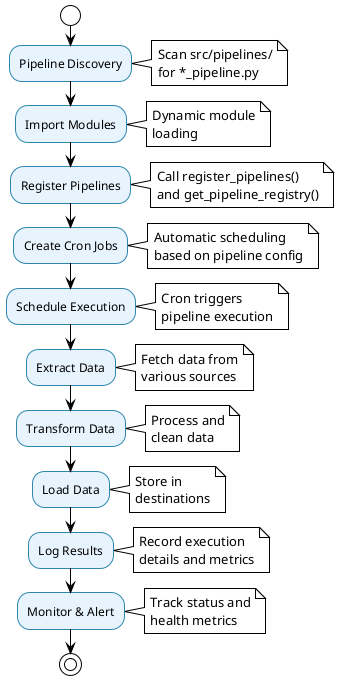
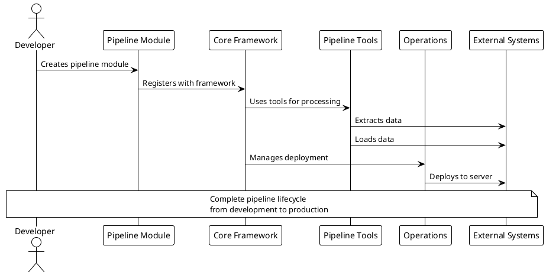

# System Overview Architecture

## 🏗️ High-Level System Architecture

The Data Processing Framework is designed as a **domain-agnostic, extensible platform** for building robust ETL/ELT data pipelines. The architecture follows clean separation of concerns with pluggable components and automatic service discovery.

## 📊 System Architecture Diagram

> 📊 **Visual Architecture**: See [System Architecture Diagram](../diagrams/system-architecture.puml) for the complete system architecture diagram.

## 🎯 Architectural Principles

### 1. **Clean Architecture**
- **Separation of Concerns**: Each layer has distinct responsibilities
- **Dependency Inversion**: High-level modules don't depend on low-level modules
- **Interface Segregation**: Components communicate through well-defined interfaces

### 2. **Plugin Architecture**
- **Extensibility**: Easy to add new extractors, transformers, and loaders
- **Modularity**: Components are loosely coupled and highly cohesive
- **Convention over Configuration**: Follow naming patterns for automatic discovery

### 3. **Auto-Discovery Pattern**
- **Zero Configuration**: Just add `*_pipeline.py` files
- **Dynamic Loading**: Framework discovers and registers automatically
- **Runtime Registration**: Pipelines become available without restart

## 🔄 Data Flow Architecture

## 🏗️ Component Interaction

## 📊 System Capabilities

### **Core Capabilities**
- ✅ **Auto-Discovery**: Zero-config pipeline registration
- ✅ **Type Safety**: Pydantic validation throughout
- ✅ **Error Handling**: Comprehensive error management
- ✅ **Logging**: Structured logging with job separation
- ✅ **Configuration**: Environment-based configuration

### **Pipeline Capabilities**
- ✅ **ETL/ELT**: Complete data processing pipelines
- ✅ **Extractors**: HTTP, Database, File data sources
- ✅ **Transformers**: Lambda, Type, Column processing
- ✅ **Loaders**: ClickHouse, Console, File destinations
- ✅ **Scheduling**: Automatic cron job management

### **Operational Capabilities**
- ✅ **Deployment**: Idempotent deployment automation
- ✅ **Testing**: Comprehensive test framework
- ✅ **Monitoring**: Health checks and data counts
- ✅ **Migration**: Database schema management
- ✅ **Backfill**: Historical data processing

## 🎯 Design Goals

### **Developer Experience**
- **Fast Development**: Focus on business logic, not infrastructure
- **Easy Testing**: Comprehensive test framework with coverage
- **Clear Documentation**: Architecture and usage guides
- **Rich Tooling**: 14-command operational toolkit

### **Operational Excellence**
- **Reliability**: Idempotent operations and error handling
- **Observability**: Structured logging and monitoring
- **Scalability**: Designed for enterprise workloads
- **Maintainability**: Clean architecture and modular design

### **Production Readiness**
- **Security**: No hardcoded secrets, secure connections
- **Performance**: Optimized for high-throughput processing
- **Monitoring**: Health checks and operational metrics
- **Deployment**: One-command production deployment

This architecture provides a **production-ready foundation** for any data processing use case while maintaining flexibility and extensibility.
