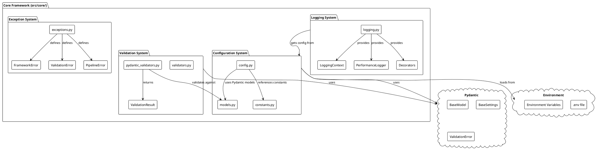
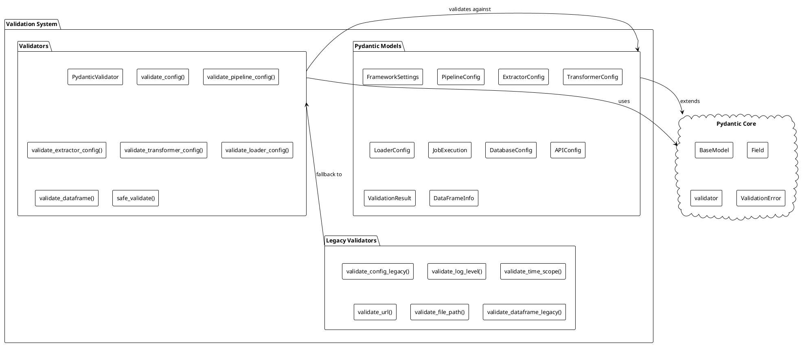
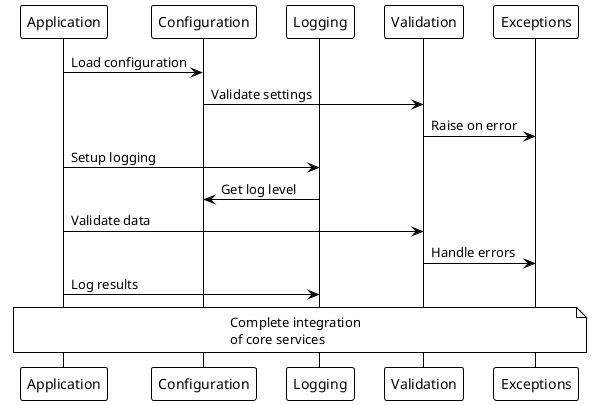

# Core Framework Architecture

## 🧩 Core Framework Components

The Core Framework (`src/core/`) provides the foundational services that support the entire data processing platform. It includes configuration management, logging, validation, and exception handling.

## 📊 Core Framework Architecture Diagram



## ⚙️ Configuration System

### Configuration Architecture

```plantuml
@startuml Configuration System
!theme plain
skinparam backgroundColor #FFFFFF
skinparam componentStyle rectangle

package "Configuration System" {
    
    component [FrameworkSettings] as FrameworkSettings {
        + log_level: str
        + timeout: int
        + batch_size: int
        + clickhouse_host: str
        + clickhouse_port: int
        + clickhouse_user: str
        + clickhouse_password: str
        + clickhouse_database: str
        + api_key: Optional[str]
        + api_base_url: Optional[str]
    }
    
    component [Config Class] as ConfigClass {
        + get(key, default)
        + get_str(key, default)
        + get_int(key, default)
        + get_bool(key, default)
        + get_clickhouse_config()
        + get_api_config()
        + to_dict()
        + update(**kwargs)
    }
    
    component [Environment Loading] as EnvLoading {
        + .env file parsing
        + Environment variable loading
        + Type conversion
        + Validation
    }
}

cloud "Environment Sources" as EnvSources {
    component [.env file] as EnvFile
    component [Environment Variables] as EnvVars
    component [Default Values] as Defaults
}

cloud "Pydantic BaseSettings" as PydanticSettings {
    component [Automatic Validation] as AutoValidation
    component [Type Conversion] as TypeConversion
    component [Field Validation] as FieldValidation
}

EnvSources --> EnvLoading : provides data
EnvLoading --> FrameworkSettings : creates instance
FrameworkSettings --> PydanticSettings : extends
ConfigClass --> FrameworkSettings : wraps

@enduml
```

### Configuration Features

- **Pydantic Integration**: Type-safe configuration with automatic validation
- **Environment Variables**: Automatic loading from `.env` and environment
- **Type Conversion**: Automatic string-to-type conversion
- **Validation**: Field validation with custom validators
- **Defaults**: Sensible defaults for all configuration options

## 📝 Logging System

### Logging Architecture

```plantuml
@startuml Logging System
!theme plain
skinparam backgroundColor #FFFFFF
skinparam componentStyle rectangle

package "Logging System" {
    
    component [setup_logging()] as SetupLogging {
        + Configure root logger
        + Set log levels
        + Create file handlers
        + Create console handlers
    }
    
    component [log_with_timestamp()] as LogWithTimestamp {
        + Tehran timezone timestamps
        + Structured log format
        + Multiple log levels
        + Category support
    }
    
    component [LoggingContext] as LoggingContext {
        + Context manager
        + Additional context variables
        + Structured logging
    }
    
    component [PerformanceLogger] as PerformanceLogger {
        + Operation timing
        + Success/failure tracking
        + Performance metrics
    }
    
    component [Decorators] as Decorators {
        + @log_function_call
        + @log_pipeline_stage
        + Automatic timing
        + Error handling
    }
    
    component [Job Loggers] as JobLoggers {
        + Per-job log files
        + Dedicated loggers
        + Isolated logging
    }
}

cloud "Log Storage" as LogStorage {
    component [logs/system/application.log] as SystemLog
    component [logs/jobs/{job_name}.log] as JobLogs
    component [logs/cron.log] as CronLog
}

cloud "Log Levels" as LogLevels {
    component [DEBUG] as Debug
    component [INFO] as Info
    component [WARNING] as Warning
    component [ERROR] as Error
}

SetupLogging --> LogStorage : creates files
LogWithTimestamp --> LogLevels : uses levels
LoggingContext --> LogWithTimestamp : enhances
PerformanceLogger --> LogWithTimestamp : uses
Decorators --> LogWithTimestamp : uses
JobLoggers --> LogStorage : creates job logs

@enduml
```

### Logging Features

- **Multi-Level Logging**: DEBUG, INFO, WARNING, ERROR levels
- **Structured Logging**: Consistent log format with timestamps
- **Job-Specific Logs**: Separate log files for each pipeline job
- **Performance Tracking**: Built-in timing and performance metrics
- **Context Management**: Rich context information in logs

## ✅ Validation System

### Validation Architecture



### Validation Features

- **Type Safety**: Automatic type validation and conversion
- **Rich Error Messages**: Detailed validation errors with context
- **Model Validation**: Comprehensive Pydantic model validation
- **Safe Validation**: Graceful error handling for user input
- **Legacy Support**: Backward compatibility with existing validators

## 🚨 Exception System

### Exception Hierarchy

```plantuml
@startuml Exception Hierarchy
!theme plain
skinparam backgroundColor #FFFFFF
skinparam classStyle rectangle

class FrameworkError {
    + message: str
    + details: Dict[str, Any]
    + __init__(message, details)
    + __str__(): str
}

class ConfigurationError {
    + Inherits from FrameworkError
    + Configuration-specific errors
}

class DatabaseError {
    + Inherits from FrameworkError
    + Database-specific errors
}

class DatabaseConnectionError {
    + Inherits from DatabaseError
    + Connection failures
}

class DatabaseQueryError {
    + Inherits from DatabaseError
    + Query execution errors
}

class PipelineError {
    + Inherits from FrameworkError
    + Pipeline-specific errors
}

class PipelineNotFoundError {
    + Inherits from PipelineError
    + Pipeline not found
}

class PipelineExecutionError {
    + Inherits from PipelineError
    + Execution failures
}

class PipelineConfigurationError {
    + Inherits from PipelineError
    + Configuration errors
}

class ExtractionError {
    + Inherits from FrameworkError
    + Data extraction errors
}

class HTTPExtractionError {
    + Inherits from ExtractionError
    + HTTP-specific errors
}

class DatabaseExtractionError {
    + Inherits from ExtractionError
    + Database extraction errors
}

class TransformationError {
    + Inherits from FrameworkError
    + Data transformation errors
}

class ValidationError {
    + Inherits from TransformationError
    + Data validation errors
}

class LoadingError {
    + Inherits from FrameworkError
    + Data loading errors
}

class DatabaseLoadingError {
    + Inherits from LoadingError
    + Database loading errors
}

class MigrationError {
    + Inherits from FrameworkError
    + Migration-specific errors
}

class MigrationNotFoundError {
    + Inherits from MigrationError
    + Migration file not found
}

class MigrationExecutionError {
    + Inherits from MigrationError
    + Migration execution errors
}

class CronError {
    + Inherits from FrameworkError
    + Cron-specific errors
}

class CronJobNotFoundError {
    + Inherits from CronError
    + Cron job not found
}

class CronScheduleError {
    + Inherits from CronError
    + Schedule validation errors
}

class RetryError {
    + Inherits from FrameworkError
    + attempts: int
    + last_error: Exception
    + Retry exhaustion errors
}

FrameworkError <|-- ConfigurationError
FrameworkError <|-- DatabaseError
FrameworkError <|-- PipelineError
FrameworkError <|-- ExtractionError
FrameworkError <|-- TransformationError
FrameworkError <|-- LoadingError
FrameworkError <|-- MigrationError
FrameworkError <|-- CronError
FrameworkError <|-- RetryError

DatabaseError <|-- DatabaseConnectionError
DatabaseError <|-- DatabaseQueryError

PipelineError <|-- PipelineNotFoundError
PipelineError <|-- PipelineExecutionError
PipelineError <|-- PipelineConfigurationError

ExtractionError <|-- HTTPExtractionError
ExtractionError <|-- DatabaseExtractionError

TransformationError <|-- ValidationError

LoadingError <|-- DatabaseLoadingError

MigrationError <|-- MigrationNotFoundError
MigrationError <|-- MigrationExecutionError

CronError <|-- CronJobNotFoundError
CronError <|-- CronScheduleError

@enduml
```



### Exception Features

- **Hierarchical Structure**: Organized exception hierarchy
- **Rich Context**: Detailed error information with context
- **Type Safety**: Specific exception types for different error scenarios
- **Debugging Support**: Comprehensive error details for troubleshooting
- **Exception Factory**: Dynamic exception creation by type

## 🔧 Core Framework Integration

### Integration Flow



## 📊 Core Framework Benefits

### **Developer Experience**
- **Type Safety**: Pydantic validation throughout
- **Rich Error Messages**: Detailed error context for debugging
- **IDE Support**: Autocomplete and type checking
- **Clear APIs**: Well-defined interfaces and documentation

### **Operational Excellence**
- **Configuration Management**: Environment-based configuration
- **Structured Logging**: Comprehensive logging with job separation
- **Error Handling**: Graceful error handling with context
- **Monitoring**: Built-in performance and health tracking

### **Maintainability**
- **Modular Design**: Clear separation of concerns
- **Extensibility**: Easy to add new validation rules
- **Testing**: Comprehensive test coverage
- **Documentation**: Self-documenting code with examples

The Core Framework provides a solid foundation for the entire data processing platform with enterprise-grade configuration, logging, validation, and error handling capabilities.
