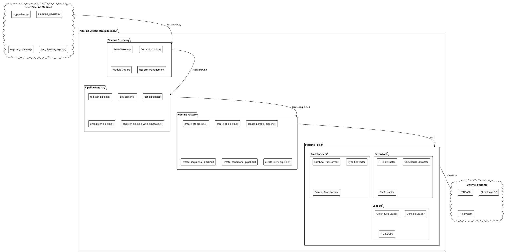
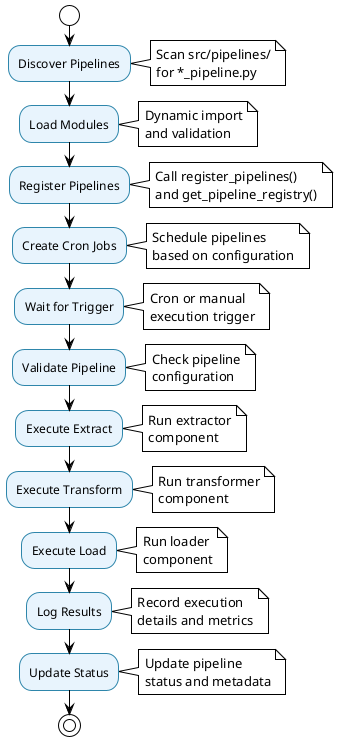

# Pipeline System Architecture

## 🔄 Pipeline System Overview

The Pipeline System (`src/pipelines/`) provides the core data processing capabilities with auto-discovery, factory patterns, and a comprehensive toolkit for building ETL/ELT pipelines.

## 📊 Pipeline System Architecture Diagram



## 🔍 Pipeline Discovery System

### Auto-Discovery Architecture

```plantuml
@startuml Pipeline Discovery
!theme plain
skinparam backgroundColor #FFFFFF
skinparam componentStyle rectangle

package "Pipeline Discovery Process" {
    
    component [File Scanner] as FileScanner {
        + Scan src/pipelines/
        + Find *_pipeline.py files
        + Filter out __init__.py
    }
    
    component [Module Loader] as ModuleLoader {
        + Dynamic import
        + Error handling
        + Module validation
    }
    
    component [Registry Builder] as RegistryBuilder {
        + Call register_pipelines()
        + Call get_pipeline_registry()
        + Build pipeline registry
    }
    
    component [Cron Manager] as CronManager {
        + Create cron jobs
        + Schedule pipelines
        + Manage job lifecycle
    }
}

cloud "Pipeline Modules" as PipelineModules {
    component [my_pipeline.py] as MyPipeline
    component [data_pipeline.py] as DataPipeline
    component [analytics_pipeline.py] as AnalyticsPipeline
}

cloud "Pipeline Registry" as PipelineRegistry {
    component [Pipeline Definitions] as PipelineDefs
    component [Cron Schedules] as CronSchedules
    component [Job Metadata] as JobMetadata
}

FileScanner --> PipelineModules : scans
ModuleLoader --> PipelineModules : imports
RegistryBuilder --> PipelineRegistry : builds
CronManager --> PipelineRegistry : uses

@enduml
```

### Discovery Features

- **Zero Configuration**: Automatic discovery of pipeline modules
- **Dynamic Loading**: Runtime module import and registration
- **Error Handling**: Graceful handling of import errors
- **Convention Over Configuration**: Follow naming patterns for automatic discovery

## 🏭 Pipeline Factory System

### Factory Architecture

```plantuml
@startuml Pipeline Factory
!theme plain
skinparam backgroundColor #FFFFFF
skinparam componentStyle rectangle

package "Pipeline Factory System" {
    
    component [ETL Pipeline Factory] as ETLFactory {
        + create_etl_pipeline()
        + extractor: Callable
        + transformer: Callable
        + loader: Callable
        + name: str
        + error_handling: bool
        + logging: bool
    }
    
    component [EL Pipeline Factory] as ELFactory {
        + create_el_pipeline()
        + extractor: Callable
        + loader: Callable
        + name: str
    }
    
    component [Parallel Pipeline Factory] as ParallelFactory {
        + create_parallel_pipeline()
        + pipelines: List[Callable]
        + max_workers: int
        + error_handling: str
    }
    
    component [Sequential Pipeline Factory] as SequentialFactory {
        + create_sequential_pipeline()
        + pipelines: List[Callable]
        + stop_on_error: bool
    }
    
    component [Conditional Pipeline Factory] as ConditionalFactory {
        + create_conditional_pipeline()
        + condition: Callable
        + true_pipeline: Callable
        + false_pipeline: Callable
    }
    
    component [Retry Pipeline Factory] as RetryFactory {
        + create_retry_pipeline()
        + pipeline: Callable
        + max_retries: int
        + backoff_factor: float
    }
}

cloud "Pipeline Components" as Components {
    component [Extractors] as Extractors
    component [Transformers] as Transformers
    component [Loaders] as Loaders
}

cloud "Pipeline Execution" as Execution {
    component [Pipeline Runner] as Runner
    component [Error Handler] as ErrorHandler
    component [Logger] as Logger
}

ETLFactory --> Components : uses
ELFactory --> Components : uses
ParallelFactory --> Components : orchestrates
SequentialFactory --> Components : orchestrates
ConditionalFactory --> Components : selects
RetryFactory --> Components : wraps

Components --> Execution : executes through

@enduml
```

### Factory Features

- **Multiple Patterns**: ETL, EL, Parallel, Sequential, Conditional, Retry
- **Type Safety**: Pydantic validation for all configurations
- **Error Handling**: Comprehensive error management
- **Logging Integration**: Automatic logging for each stage
- **Flexible Configuration**: Customizable pipeline behavior

## 🛠️ Pipeline Tools Architecture

### Tools System Overview

```plantuml
@startuml Pipeline Tools
!theme plain
skinparam backgroundColor #FFFFFF
skinparam componentStyle rectangle

package "Pipeline Tools System" {
    
    package "Extractors" as Extractors {
        component [HTTP Extractor] as HttpExtractor {
            + create_http_extractor()
            + url: str
            + headers: Dict[str, str]
            + timeout: int
            + retry_logic: bool
            + rate_limiting: bool
        }
        
        component [ClickHouse Extractor] as ChExtractor {
            + create_clickhouse_extractor()
            + query: str
            + connection_config: Dict
            + batch_size: int
        }
        
        component [File Extractor] as FileExtractor {
            + create_file_extractor()
            + file_path: str
            + file_format: str
            + encoding: str
        }
    }
    
    package "Transformers" as Transformers {
        component [Lambda Transformer] as LambdaTransformer {
            + create_lambda_transformer()
            + function: Callable
            + name: str
            + error_handling: bool
        }
        
        component [Type Converter] as TypeConverter {
            + convert_types()
            + type_mapping: Dict
            + strict_mode: bool
        }
        
        component [Column Transformer] as ColumnTransformer {
            + transform_columns()
            + column_mapping: Dict
            + new_columns: List[str]
        }
    }
    
    package "Loaders" as Loaders {
        component [ClickHouse Loader] as ChLoader {
            + create_clickhouse_loader()
            + table: str
            + columns: List[str]
            + mode: str (insert/upsert)
            + batch_size: int
        }
        
        component [Console Loader] as ConsoleLoader {
            + create_console_loader()
            + format: str
            + show_progress: bool
        }
        
        component [File Loader] as FileLoader {
            + create_file_loader()
            + file_path: str
            + format: str
            + compression: str
        }
    }
}

cloud "Data Sources" as DataSources {
    component [HTTP APIs] as HttpAPIs
    component [ClickHouse DB] as ClickHouseDB
    component [File System] as FileSystem
}

cloud "Data Destinations" as DataDestinations {
    component [ClickHouse Tables] as ChTables
    component [Console Output] as ConsoleOutput
    component [File Output] as FileOutput
}

Extractors --> DataSources : extracts from
Loaders --> DataDestinations : loads to

@enduml
```

### Tools Features

- **Plugin Architecture**: Easy to add new extractors, transformers, loaders
- **Type Safety**: Pydantic validation for all tool configurations
- **Error Handling**: Comprehensive error management with retry logic
- **Performance**: Optimized for high-throughput data processing
- **Flexibility**: Configurable behavior for different use cases

## 📋 Pipeline Registry System

### Registry Architecture

```plantuml
@startuml Pipeline Registry
!theme plain
skinparam backgroundColor #FFFFFF
skinparam componentStyle rectangle

package "Pipeline Registry System" {
    
    component [Pipeline Registry] as PipelineRegistry {
        + pipelines: Dict[str, Dict]
        + cron_jobs: Dict[str, Dict]
        + metadata: Dict[str, Any]
    }
    
    component [Registration Manager] as RegistrationManager {
        + register_pipeline()
        + unregister_pipeline()
        + get_pipeline()
        + list_pipelines()
        + validate_pipeline()
    }
    
    component [Cron Manager] as CronManager {
        + register_cron_job()
        + remove_cron_job()
        + list_cron_jobs()
        + get_cron_job()
        + validate_schedule()
    }
    
    component [Timescope Manager] as TimescopeManager {
        + register_pipeline_with_timescope()
        + get_table_name()
        + validate_timescope()
    }
}

cloud "Pipeline Modules" as PipelineModules {
    component [Pipeline Definitions] as PipelineDefs
    component [Schedule Configs] as ScheduleConfigs
    component [Metadata] as Metadata
}

cloud "Cron System" as CronSystem {
    component [Cron Jobs] as CronJobs
    component [Schedules] as Schedules
    component [Job Status] as JobStatus
}

RegistrationManager --> PipelineRegistry : manages
CronManager --> PipelineRegistry : uses
TimescopeManager --> PipelineRegistry : extends
PipelineModules --> RegistrationManager : registers with
CronSystem --> CronManager : manages

@enduml
```

### Registry Features

- **Centralized Management**: Single source of truth for all pipelines
- **Dynamic Registration**: Runtime pipeline registration and removal
- **Cron Integration**: Automatic cron job creation and management
- **Timescope Support**: Time-based pipeline organization
- **Validation**: Comprehensive pipeline configuration validation

## 🔄 Pipeline Execution Flow

### Execution Architecture



## 📊 Pipeline System Benefits

### **Developer Experience**
- **Zero Configuration**: Auto-discovery eliminates setup overhead
- **Type Safety**: Pydantic validation throughout the system
- **Rich Tooling**: Comprehensive toolkit for data processing
- **Clear Patterns**: Well-defined patterns for common use cases

### **Operational Excellence**
- **Automatic Scheduling**: Cron job management without manual setup
- **Error Handling**: Comprehensive error management and recovery
- **Monitoring**: Built-in logging and performance tracking
- **Flexibility**: Multiple pipeline patterns for different scenarios

### **Maintainability**
- **Plugin Architecture**: Easy to extend with new components
- **Modular Design**: Clear separation of concerns
- **Testing**: Comprehensive test coverage for all components
- **Documentation**: Self-documenting code with examples

The Pipeline System provides a complete foundation for building robust, scalable data processing pipelines with minimal configuration and maximum flexibility.
