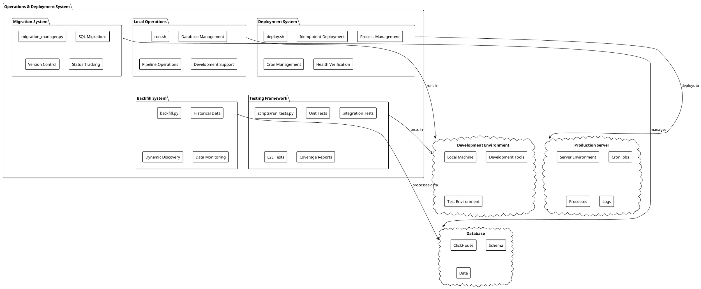
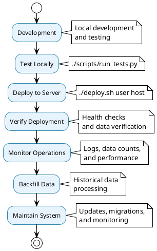

# Operations & Deployment Architecture

## 🚀 Operations & Deployment Overview

The Operations & Deployment system provides comprehensive tools for managing the data processing framework in production environments, including deployment automation, testing, migration management, and operational monitoring.

## 📊 Operations & Deployment Architecture Diagram



## 🚀 Deployment System

### Deployment Architecture

```plantuml
@startuml Deployment System
!theme plain
skinparam backgroundColor #FFFFFF
skinparam componentStyle rectangle

package "Deployment Process" {
    
    component [Step 1: Clean] as Step1 {
        + Kill existing processes
        + Remove old crons
        + Clean deployment directory
    }
    
    component [Step 2: Sync] as Step2 {
        + Sync project files
        + Preserve logs
        + Update dependencies
    }
    
    component [Step 3: Provision] as Step3 {
        + Create virtual environment
        + Install dependencies
        + Setup .env configuration
    }
    
    component [Step 4: Migrate] as Step4 {
        + Run database migrations
        + Verify schema
        + Check connectivity
    }
    
    component [Step 5: Test] as Step5 {
        + Reset logs
        + Test framework
        + Verify functionality
    }
    
    component [Step 6: Schedule] as Step6 {
        + Install cron jobs
        + Setup scheduling
        + Configure monitoring
    }
    
    component [Step 7: Verify] as Step7 {
        + Health checks
        + Data verification
        + Process monitoring
    }
}

cloud "Source Environment" as SourceEnv {
    component [Project Files] as ProjectFiles
    component [Dependencies] as Dependencies
    component [Configuration] as Configuration
}

cloud "Target Server" as TargetServer {
    component [Deployment Directory] as DeployDir
    component [Virtual Environment] as Venv
    component [Cron Jobs] as CronJobs
    component [Processes] as Processes
}

Step1 --> TargetServer : cleans
Step2 --> TargetServer : syncs
Step3 --> TargetServer : provisions
Step4 --> TargetServer : migrates
Step5 --> TargetServer : tests
Step6 --> TargetServer : schedules
Step7 --> TargetServer : verifies

SourceEnv --> Step2 : provides files

@enduml
```

### Deployment Features

- **Idempotent Design**: Safe to run multiple times
- **Process Management**: Automatic process cleanup and management
- **Cron Management**: Automatic cron job installation and removal
- **Health Verification**: Post-deployment health checks
- **Flexible Deployment**: Supports multiple deployment targets

## ⚙️ Local Operations System

### Operations Architecture

```plantuml
@startuml Local Operations
!theme plain
skinparam backgroundColor #FFFFFF
skinparam componentStyle rectangle

package "Local Operations (run.sh)" {
    
    package "Database Operations" as DatabaseOps {
        component [setup_db] as SetupDB
        component [drop_db] as DropDB
        component [migrate] as Migrate
        component [migrate_status] as MigrateStatus
    }
    
    package "Pipeline Operations" as PipelineOps {
        component [cron_run NAME] as CronRun
        component [list] as List
        component [setup_cron NAME] as SetupCron
    }
    
    package "Data Operations" as DataOps {
        component [backfill [DAYS] [JOBS]] as Backfill
        component [backfill_list] as BackfillList
        component [backfill_counts] as BackfillCounts
    }
    
    package "Process Operations" as ProcessOps {
        component [kill] as Kill
        component [clean] as Clean
        component [check] as Check
    }
    
    package "Development Operations" as DevOps {
        component [test] as Test
        component [help] as Help
    }
}

cloud "Database" as Database {
    component [ClickHouse] as ClickHouse
    component [Tables] as Tables
    component [Schema] as Schema
}

cloud "Pipelines" as Pipelines {
    component [Pipeline Registry] as PipelineRegistry
    component [Cron Jobs] as CronJobs
    component [Job Status] as JobStatus
}

cloud "System" as System {
    component [Processes] as Processes
    component [Logs] as Logs
    component [Configuration] as Configuration
}

DatabaseOps --> Database : manages
PipelineOps --> Pipelines : operates
DataOps --> Database : processes
ProcessOps --> System : manages

@enduml
```

### Operations Features

- **14 Commands**: Complete operational toolkit
- **Database Management**: Setup, migration, and status checking
- **Pipeline Operations**: Execution, listing, and cron management
- **Data Operations**: Backfill and monitoring capabilities
- **Process Management**: Clean process lifecycle management

## 🗄️ Migration System

### Migration Architecture

```plantuml
@startuml Migration System
!theme plain
skinparam backgroundColor #FFFFFF
skinparam componentStyle rectangle

package "Migration System" {
    
    component [Migration Manager] as MigrationManager {
        + run_migrations()
        + get_migration_status()
        + create_migration()
        + rollback_migration()
    }
    
    component [Migration Registry] as MigrationRegistry {
        + executed_migrations: List[str]
        + pending_migrations: List[str]
        + migration_history: Dict
    }
    
    component [SQL Parser] as SQLParser {
        + parse_sql_file()
        + validate_sql()
        + extract_dependencies()
    }
    
    component [Version Control] as VersionControl {
        + compare_versions()
        + sort_migrations()
        + detect_conflicts()
    }
}

cloud "SQL Migrations" as SQLMigrations {
    component [001_initial.sql] as Migration1
    component [002_feature.sql] as Migration2
    component [003_update.sql] as Migration3
}

cloud "ClickHouse Database" as ClickHouseDB {
    component [migrations table] as MigrationsTable
    component [Schema] as Schema
    component [Data] as Data
}

MigrationManager --> MigrationRegistry : manages
MigrationManager --> SQLParser : uses
MigrationManager --> VersionControl : uses
SQLParser --> SQLMigrations : parses
MigrationManager --> ClickHouseDB : executes against

@enduml
```

### Migration Features

- **Version Control**: SQL-based database versioning
- **Automatic Execution**: Runs pending migrations on startup
- **Status Tracking**: Migration history and status monitoring
- **Rollback Safety**: Tracks executed migrations for safety
- **Conflict Detection**: Identifies migration conflicts

## 🧪 Testing Framework

### Testing Architecture

```plantuml
@startuml Testing Framework
!theme plain
skinparam backgroundColor #FFFFFF
skinparam componentStyle rectangle

package "Testing Framework" {
    
    component [Test Runner] as TestRunner {
        + scripts/run_tests.py
        + --unit: Unit tests only
        + --integration: Integration tests only
        + --fast: Skip slow tests
        + --coverage: Generate coverage reports
    }
    
    package "Test Types" as TestTypes {
        component [Unit Tests] as UnitTests {
            + test_core_components.py
            + Component testing
            + Mock dependencies
        }
        
        component [Integration Tests] as IntegrationTests {
            + test_framework_integration.py
            + test_deployment.py
            + End-to-end testing
        }
        
        component [E2E Tests] as E2ETests {
            + Complete workflow testing
            + Real environment testing
        }
    }
    
    package "Test Results" as TestResults {
        component [JSON Results] as JSONResults
        component [Coverage Reports] as CoverageReports
        component [JUnit XML] as JUnitXML
        component [Performance Metrics] as PerformanceMetrics
    }
}

cloud "Test Environment" as TestEnv {
    component [Test Database] as TestDB
    component [Mock Services] as MockServices
    component [Test Data] as TestData
}

cloud "CI/CD Integration" as CICD {
    component [Pipeline Integration] as PipelineIntegration
    component [Coverage Gates] as CoverageGates
    component [Performance Gates] as PerformanceGates
}

TestRunner --> TestTypes : executes
TestTypes --> TestEnv : uses
TestRunner --> TestResults : generates
TestResults --> CICD : integrates with

@enduml
```

### Testing Features

- **Comprehensive Coverage**: Unit + Integration + E2E tests
- **Result Tracking**: JSON results with detailed metrics
- **Coverage Reports**: HTML and JSON coverage analysis
- **CI/CD Integration**: JUnit XML for pipeline integration
- **Performance Metrics**: Test duration and performance tracking

## 📊 Backfill System

### Backfill Architecture

```plantuml
@startuml Backfill System
!theme plain
skinparam backgroundColor #FFFFFF
skinparam componentStyle rectangle

package "Backfill System" {
    
    component [Backfill Manager] as BackfillManager {
        + backfill.py
        + run_backfill()
        + discover_jobs()
        + monitor_data()
    }
    
    component [Job Discovery] as JobDiscovery {
        + scan_pipelines()
        + identify_backfillable_jobs()
        + validate_job_config()
    }
    
    component [Data Processor] as DataProcessor {
        + process_historical_data()
        + handle_date_ranges()
        + manage_batch_processing()
    }
    
    component [Data Monitor] as DataMonitor {
        + check_data_counts()
        + verify_data_quality()
        + track_processing_status()
    }
}

cloud "Pipeline Jobs" as PipelineJobs {
    component [Available Jobs] as AvailableJobs
    component [Job Configurations] as JobConfigs
    component [Schedule Info] as ScheduleInfo
}

cloud "Historical Data" as HistoricalData {
    component [Date Ranges] as DateRanges
    component [Data Sources] as DataSources
    component [Processed Data] as ProcessedData
}

cloud "Database" as Database {
    component [ClickHouse Tables] as ChTables
    component [Data Counts] as DataCounts
    component [Data Quality] as DataQuality
}

BackfillManager --> JobDiscovery : uses
BackfillManager --> DataProcessor : orchestrates
BackfillManager --> DataMonitor : monitors
JobDiscovery --> PipelineJobs : discovers
DataProcessor --> HistoricalData : processes
DataMonitor --> Database : monitors

@enduml
```

### Backfill Features

- **Historical Data**: Backfill jobs for date ranges
- **Dynamic Discovery**: Auto-discovers available jobs
- **Data Monitoring**: Table count verification
- **Flexible Execution**: Single job or all jobs
- **Quality Assurance**: Data quality verification

## 🔄 Operations Workflow

### Complete Operations Flow



## 📊 Operations & Deployment Benefits

### **Operational Excellence**
- **Idempotent Deployment**: Safe, repeatable deployments
- **Process Management**: Clean process lifecycle management
- **Health Monitoring**: Comprehensive health checks and verification
- **Data Management**: Complete data processing and monitoring capabilities

### **Developer Experience**
- **Local Development**: Complete local development environment
- **Testing Framework**: Comprehensive testing with coverage reporting
- **Operational Tools**: 14-command toolkit for all operations
- **Clear Documentation**: Architecture and usage documentation

### **Production Readiness**
- **Deployment Automation**: One-command production deployment
- **Migration Management**: Version-controlled database schema management
- **Monitoring**: Built-in logging, health checks, and data monitoring
- **Reliability**: Idempotent operations and comprehensive error handling

The Operations & Deployment system provides a complete foundation for managing the data processing framework in production environments with enterprise-grade reliability, monitoring, and operational excellence.
