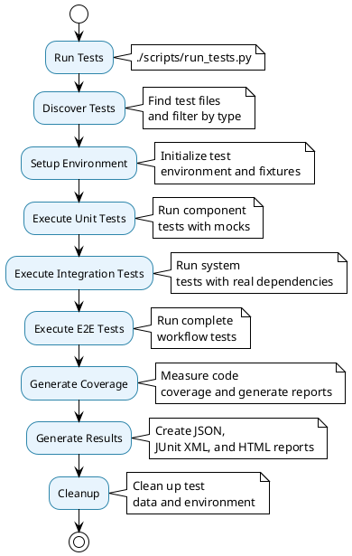

# Testing Framework Architecture

## 🧪 Testing Framework Overview

The Testing Framework provides comprehensive testing capabilities for the data processing platform, including unit tests, integration tests, end-to-end tests, and automated test result reporting with coverage analysis.

## 📊 Testing Framework Architecture Diagram

```plantuml
@startuml Testing Framework
!theme plain
skinparam backgroundColor #FFFFFF
skinparam componentStyle rectangle

package "Testing Framework" {
    
    package "Test Runner" as TestRunner {
        component [scripts/run_tests.py] as TestRunnerScript
        component [Test Configuration] as TestConfig
        component [Test Discovery] as TestDiscovery
        component [Test Execution] as TestExecution
        component [Result Generation] as ResultGeneration
    }
    
    package "Test Types" as TestTypes {
        component [Unit Tests] as UnitTests {
            + test_core_components.py
            + Component testing
            + Mock dependencies
            + Fast execution
        }
        
        component [Integration Tests] as IntegrationTests {
            + test_framework_integration.py
            + test_deployment.py
            + System integration
            + Real dependencies
        }
        
        component [E2E Tests] as E2ETests {
            + Complete workflow testing
            + Real environment testing
            + Full data flow
        }
    }
    
    package "Test Infrastructure" as TestInfrastructure {
        component [conftest.py] as Conftest
        component [Fixtures] as Fixtures
        component [Mock Services] as MockServices
        component [Test Data] as TestData
    }
    
    package "Test Results" as TestResults {
        component [JSON Results] as JSONResults
        component [Coverage Reports] as CoverageReports
        component [JUnit XML] as JUnitXML
        component [Performance Metrics] as PerformanceMetrics
    }
}

cloud "Test Environment" as TestEnv {
    component [Test Database] as TestDB
    component [Mock APIs] as MockAPIs
    component [Test Files] as TestFiles
    component [Temporary Data] as TempData
}

cloud "CI/CD Integration" as CICD {
    component [Pipeline Integration] as PipelineIntegration
    component [Coverage Gates] as CoverageGates
    component [Performance Gates] as PerformanceGates
    component [Quality Gates] as QualityGates
}

TestRunner --> TestTypes : executes
TestTypes --> TestInfrastructure : uses
TestRunner --> TestResults : generates
TestInfrastructure --> TestEnv : provides
TestResults --> CICD : integrates with

@enduml
```

## 🏃 Test Runner System

### Test Runner Architecture

```plantuml
@startuml Test Runner
!theme plain
skinparam backgroundColor #FFFFFF
skinparam componentStyle rectangle

package "Test Runner (scripts/run_tests.py)" {
    
    component [Command Line Interface] as CLI {
        + --unit: Unit tests only
        + --integration: Integration tests only
        + --fast: Skip slow tests
        + --coverage: Generate coverage reports
        + --verbose: Verbose output
    }
    
    component [Test Discovery] as TestDiscovery {
        + Find test files
        + Filter by type
        + Sort by priority
    }
    
    component [Test Execution] as TestExecution {
        + Run tests
        + Collect results
        + Handle failures
        + Measure performance
    }
    
    component [Coverage Analysis] as CoverageAnalysis {
        + Measure code coverage
        + Generate HTML reports
        + Generate JSON reports
        + Identify gaps
    }
    
    component [Result Generation] as ResultGeneration {
        + JSON results
        + JUnit XML
        + Coverage reports
        + Performance metrics
    }
}

cloud "Test Files" as TestFiles {
    component [tests/unit/] as UnitTests
    component [tests/integration/] as IntegrationTests
    component [tests/e2e/] as E2ETests
}

cloud "Results Directory" as ResultsDir {
    component [tests/results/] as ResultsDir
    component [latest_test_results.json] as LatestResults
    component [coverage_html/] as CoverageHTML
    component [junit_results.xml] as JUnitXML
}

CLI --> TestDiscovery : configures
TestDiscovery --> TestFiles : scans
TestExecution --> TestFiles : runs
CoverageAnalysis --> TestFiles : analyzes
ResultGeneration --> ResultsDir : saves

@enduml
```

### Test Runner Features

- **Multiple Test Types**: Unit, Integration, E2E test execution
- **Coverage Analysis**: Comprehensive code coverage reporting
- **Performance Metrics**: Test execution time and performance tracking
- **CI/CD Integration**: JUnit XML and coverage reports for pipelines
- **Flexible Execution**: Command-line options for different test scenarios

## 🧩 Unit Testing System

### Unit Test Architecture

```plantuml
@startuml Unit Testing
!theme plain
skinparam backgroundColor #FFFFFF
skinparam componentStyle rectangle

package "Unit Testing System" {
    
    component [test_core_components.py] as CoreTests {
        + Test configuration system
        + Test logging system
        + Test validation system
        + Test exception system
    }
    
    component [Test Fixtures] as TestFixtures {
        + Mock configurations
        + Mock databases
        + Mock APIs
        + Test data generators
    }
    
    component [Mock Services] as MockServices {
        + Mock ClickHouse
        + Mock HTTP APIs
        + Mock file system
        + Mock cron system
    }
    
    component [Assertion Helpers] as AssertionHelpers {
        + Data validation helpers
        + Error checking helpers
        + Performance helpers
        + Mock verification helpers
    }
}

cloud "Core Components" as CoreComponents {
    component [Configuration] as Config
    component [Logging] as Logging
    component [Validation] as Validation
    component [Exceptions] as Exceptions
}

cloud "Test Data" as TestData {
    component [Sample Configs] as SampleConfigs
    component [Test DataFrames] as TestDataFrames
    component [Mock Responses] as MockResponses
}

CoreTests --> CoreComponents : tests
CoreTests --> TestFixtures : uses
TestFixtures --> MockServices : provides
TestFixtures --> TestData : uses
CoreTests --> AssertionHelpers : uses

@enduml
```

### Unit Test Features

- **Component Testing**: Individual component testing with mocks
- **Fast Execution**: Quick test execution for rapid development
- **Mock Dependencies**: Isolated testing without external dependencies
- **Comprehensive Coverage**: Tests for all core components
- **Error Scenarios**: Testing error handling and edge cases

## 🔗 Integration Testing System

### Integration Test Architecture

```plantuml
@startuml Integration Testing
!theme plain
skinparam backgroundColor #FFFFFF
skinparam componentStyle rectangle

package "Integration Testing System" {
    
    component [test_framework_integration.py] as FrameworkTests {
        + Test complete framework
        + Test pipeline discovery
        + Test cron job creation
        + Test end-to-end workflows
    }
    
    component [test_deployment.py] as DeploymentTests {
        + Test deployment process
        + Test server setup
        + Test cron installation
        + Test health verification
    }
    
    component [Test Environment] as TestEnv {
        + Real database connections
        + Real file system operations
        + Real network requests
        + Real cron job creation
    }
    
    component [Test Cleanup] as TestCleanup {
        + Cleanup test data
        + Remove test cron jobs
        + Cleanup test files
        + Reset test environment
    }
}

cloud "Real Dependencies" as RealDeps {
    component [ClickHouse Database] as ClickHouseDB
    component [File System] as FileSystem
    component [Network APIs] as NetworkAPIs
    component [Cron System] as CronSystem
}

cloud "Test Scenarios" as TestScenarios {
    component [Pipeline Discovery] as PipelineDiscovery
    component [Data Processing] as DataProcessing
    component [Error Handling] as ErrorHandling
    component [Performance] as Performance
}

FrameworkTests --> TestEnv : uses
DeploymentTests --> TestEnv : uses
TestEnv --> RealDeps : connects to
TestEnv --> TestScenarios : tests
TestCleanup --> TestEnv : cleans up

@enduml
```

### Integration Test Features

- **System Integration**: Testing complete system workflows
- **Real Dependencies**: Testing with real external dependencies
- **End-to-End Testing**: Complete data flow testing
- **Deployment Testing**: Testing deployment and server setup
- **Performance Testing**: Testing system performance under load

## 📊 Test Results System

### Test Results Architecture

```plantuml
@startuml Test Results
!theme plain
skinparam backgroundColor #FFFFFF
skinparam componentStyle rectangle

package "Test Results System" {
    
    component [JSON Results] as JSONResults {
        + latest_test_results.json
        + Test execution data
        + Performance metrics
        + Coverage data
        + Error details
    }
    
    component [Coverage Reports] as CoverageReports {
        + coverage_html/
        + HTML coverage reports
        + coverage.json
        + Coverage metrics
        + Gap analysis
    }
    
    component [JUnit XML] as JUnitXML {
        + junit_results.xml
        + CI/CD integration
        + Test case results
        + Failure details
        + Timing information
    }
    
    component [Performance Metrics] as PerformanceMetrics {
        + Test execution time
        + Memory usage
        + CPU usage
        + I/O operations
        + Network requests
    }
}

cloud "Test Execution" as TestExecution {
    component [Test Runner] as TestRunner
    component [Test Cases] as TestCases
    component [Test Results] as TestResults
}

cloud "CI/CD Pipeline" as CICD {
    component [Build Pipeline] as BuildPipeline
    component [Quality Gates] as QualityGates
    component [Coverage Gates] as CoverageGates
    component [Performance Gates] as PerformanceGates
}

TestExecution --> JSONResults : generates
TestExecution --> CoverageReports : generates
TestExecution --> JUnitXML : generates
TestExecution --> PerformanceMetrics : generates
JUnitXML --> CICD : integrates with
CoverageReports --> CICD : integrates with

@enduml
```

### Test Results Features

- **Comprehensive Reporting**: Detailed test execution reports
- **Coverage Analysis**: HTML and JSON coverage reports
- **CI/CD Integration**: JUnit XML for pipeline integration
- **Performance Tracking**: Test execution and performance metrics
- **Historical Tracking**: Test result history and trends

## 🔧 Test Infrastructure

### Test Infrastructure Architecture

```plantuml
@startuml Test Infrastructure
!theme plain
skinparam backgroundColor #FFFFFF
skinparam componentStyle rectangle

package "Test Infrastructure" {
    
    component [conftest.py] as Conftest {
        + Pytest configuration
        + Global fixtures
        + Test setup/teardown
        + Test data management
    }
    
    component [Fixtures] as Fixtures {
        + Database fixtures
        + API fixtures
        + File fixtures
        + Configuration fixtures
    }
    
    component [Mock Services] as MockServices {
        + Mock ClickHouse
        + Mock HTTP APIs
        + Mock file system
        + Mock cron system
    }
    
    component [Test Data] as TestData {
        + Sample configurations
        + Test DataFrames
        + Mock responses
        + Test files
    }
    
    component [Test Utilities] as TestUtilities {
        + Assertion helpers
        + Data generators
        + Mock builders
        + Test decorators
    }
}

cloud "Test Environment" as TestEnv {
    component [Test Database] as TestDB
    component [Test Files] as TestFiles
    component [Mock Services] as MockServices
    component [Test Configuration] as TestConfig
}

Conftest --> Fixtures : provides
Conftest --> MockServices : provides
Conftest --> TestData : provides
Fixtures --> TestEnv : manages
MockServices --> TestEnv : provides
TestUtilities --> TestEnv : supports

@enduml
```

### Test Infrastructure Features

- **Pytest Integration**: Full pytest framework integration
- **Fixture Management**: Comprehensive fixture system
- **Mock Services**: Complete mock service ecosystem
- **Test Data**: Rich test data generation and management
- **Utility Functions**: Helper functions for common test scenarios

## 🔄 Testing Workflow

### Complete Testing Flow



## 📊 Testing Framework Benefits

### **Quality Assurance**
- **Comprehensive Coverage**: Unit + Integration + E2E testing
- **Code Coverage**: Detailed coverage analysis and reporting
- **Performance Testing**: Performance metrics and monitoring
- **Quality Gates**: Automated quality checks and gates

### **Developer Experience**
- **Fast Feedback**: Quick test execution for rapid development
- **Clear Results**: Detailed test results and coverage reports
- **Easy Debugging**: Rich error information and test data
- **CI/CD Integration**: Seamless integration with build pipelines

### **Operational Excellence**
- **Automated Testing**: Automated test execution and reporting
- **Quality Monitoring**: Continuous quality monitoring and tracking
- **Regression Prevention**: Automated regression testing
- **Performance Monitoring**: Performance regression detection

The Testing Framework provides a complete foundation for ensuring code quality, reliability, and performance throughout the development and deployment lifecycle.
