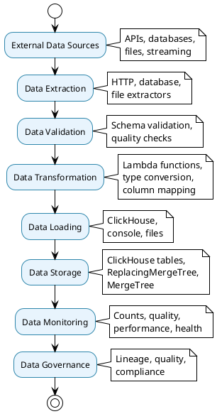

# Data Flow & Storage Architecture

## 🔄 Data Flow & Storage Overview

The Data Flow & Storage architecture defines how data moves through the system, from external sources through processing pipelines to final storage destinations, with comprehensive data management and monitoring capabilities.

## 📊 Data Flow Architecture Diagram

```plantuml
@startuml Data Flow & Storage
!theme plain
skinparam backgroundColor #FFFFFF
skinparam componentStyle rectangle

package "Data Flow & Storage System" {
    
    package "Data Sources" as DataSources {
        component [HTTP APIs] as HttpAPIs {
            + REST APIs
            + GraphQL APIs
            + Webhook endpoints
            + Rate limiting
        }
        
        component [Databases] as Databases {
            + ClickHouse queries
            + SQL databases
            + NoSQL databases
            + Data warehouses
        }
        
        component [File Systems] as FileSystems {
            + Local files
            + Network files
            + Cloud storage
            + Streaming data
        }
    }
    
    package "Data Processing" as DataProcessing {
        component [Extractors] as Extractors {
            + HTTP extractors
            + Database extractors
            + File extractors
            + Streaming extractors
        }
        
        component [Transformers] as Transformers {
            + Lambda transformers
            + Type converters
            + Column transformers
            + Data validators
        }
        
        component [Loaders] as Loaders {
            + ClickHouse loaders
            + Console loaders
            + File loaders
            + Streaming loaders
        }
    }
    
    package "Data Storage" as DataStorage {
        component [ClickHouse Tables] as ClickHouseTables {
            + ReplacingMergeTree
            + MergeTree
            + Distributed tables
            + Materialized views
        }
        
        component [Data Management] as DataManagement {
            + Schema management
            + Data validation
            + Data quality
            + Data lineage
        }
    }
    
    package "Data Monitoring" as DataMonitoring {
        component [Data Counts] as DataCounts
        component [Data Quality] as DataQuality
        component [Performance Metrics] as PerformanceMetrics
        component [Health Checks] as HealthChecks
    }
}

cloud "External Systems" as ExternalSystems {
    component [Third-party APIs] as ThirdPartyAPIs
    component [Data Providers] as DataProviders
    component [Cloud Services] as CloudServices
}

cloud "Storage Systems" as StorageSystems {
    component [ClickHouse Cluster] as ClickHouseCluster
    component [File Storage] as FileStorage
    component [Backup Systems] as BackupSystems
}

DataSources --> DataProcessing : extracts from
DataProcessing --> DataStorage : loads to
DataStorage --> DataMonitoring : monitors
ExternalSystems --> DataSources : provides data
StorageSystems --> DataStorage : stores data

@enduml
```

## 📥 Data Extraction Architecture

### Extraction System

```plantuml
@startuml Data Extraction
!theme plain
skinparam backgroundColor #FFFFFF
skinparam componentStyle rectangle

package "Data Extraction System" {
    
    component [HTTP Extractor] as HttpExtractor {
        + URL configuration
        + Headers management
        + Authentication
        + Rate limiting
        + Retry logic
        + Error handling
    }
    
    component [Database Extractor] as DatabaseExtractor {
        + Query configuration
        + Connection management
        + Batch processing
        + Transaction handling
        + Error recovery
    }
    
    component [File Extractor] as FileExtractor {
        + File path configuration
        + Format detection
        + Encoding handling
        + Chunk processing
        + Error handling
    }
    
    component [Extraction Manager] as ExtractionManager {
        + Orchestrate extractors
        + Handle errors
        + Manage retries
        + Monitor performance
    }
}

cloud "Data Sources" as DataSources {
    component [REST APIs] as RestAPIs
    component [ClickHouse DB] as ClickHouseDB
    component [File System] as FileSystem
}

cloud "Extracted Data" as ExtractedData {
    component [Raw Data] as RawData
    component [Metadata] as Metadata
    component [Quality Metrics] as QualityMetrics
}

HttpExtractor --> RestAPIs : extracts from
DatabaseExtractor --> ClickHouseDB : queries
FileExtractor --> FileSystem : reads from
ExtractionManager --> ExtractedData : produces

@enduml
```

### Extraction Features

- **Multiple Sources**: HTTP APIs, databases, files, streaming data
- **Error Handling**: Comprehensive error handling and retry logic
- **Rate Limiting**: Built-in rate limiting for API sources
- **Batch Processing**: Efficient batch processing for large datasets
- **Quality Monitoring**: Data quality metrics and validation

## 🔄 Data Transformation Architecture

### Transformation System

```plantuml
@startuml Data Transformation
!theme plain
skinparam backgroundColor #FFFFFF
skinparam componentStyle rectangle

package "Data Transformation System" {
    
    component [Lambda Transformer] as LambdaTransformer {
        + Custom functions
        + Data processing
        + Type conversion
        + Validation
        + Error handling
    }
    
    component [Type Converter] as TypeConverter {
        + Data type conversion
        + Format standardization
        + Validation rules
        + Error handling
    }
    
    component [Column Transformer] as ColumnTransformer {
        + Column mapping
        + Column creation
        + Column validation
        + Data cleaning
    }
    
    component [Data Validator] as DataValidator {
        + Schema validation
        + Data quality checks
        + Business rule validation
        + Error reporting
    }
    
    component [Transformation Pipeline] as TransformationPipeline {
        + Orchestrate transformers
        + Handle dependencies
        + Manage errors
        + Monitor performance
    }
}

cloud "Raw Data" as RawData {
    component [Extracted Data] as ExtractedData
    component [Metadata] as Metadata
    component [Quality Issues] as QualityIssues
}

cloud "Transformed Data" as TransformedData {
    component [Processed Data] as ProcessedData
    component [Validated Data] as ValidatedData
    component [Quality Metrics] as QualityMetrics
}

LambdaTransformer --> RawData : processes
TypeConverter --> RawData : converts
ColumnTransformer --> RawData : transforms
DataValidator --> RawData : validates
TransformationPipeline --> TransformedData : produces

@enduml
```

### Transformation Features

- **Flexible Processing**: Lambda functions for custom transformations
- **Type Safety**: Automatic type conversion and validation
- **Data Quality**: Built-in data quality checks and validation
- **Error Handling**: Comprehensive error handling and recovery
- **Performance**: Optimized transformation pipelines

## 📤 Data Loading Architecture

### Loading System

```plantuml
@startuml Data Loading
!theme plain
skinparam backgroundColor #FFFFFF
skinparam componentStyle rectangle

package "Data Loading System" {
    
    component [ClickHouse Loader] as ClickHouseLoader {
        + Table configuration
        + Column mapping
        + Upsert logic
        + Batch processing
        + Error handling
    }
    
    component [Console Loader] as ConsoleLoader {
        + Output formatting
        + Progress display
        + Error reporting
        + Debug information
    }
    
    component [File Loader] as FileLoader {
        + File format configuration
        + Compression options
        + Chunk processing
        + Error handling
    }
    
    component [Loading Manager] as LoadingManager {
        + Orchestrate loaders
        + Handle errors
        + Manage transactions
        + Monitor performance
    }
}

cloud "Transformed Data" as TransformedData {
    component [Processed Data] as ProcessedData
    component [Validation Results] as ValidationResults
    component [Quality Metrics] as QualityMetrics
}

cloud "Storage Destinations" as StorageDestinations {
    component [ClickHouse Tables] as ClickHouseTables
    component [Console Output] as ConsoleOutput
    component [File Output] as FileOutput
}

ClickHouseLoader --> ClickHouseTables : loads to
ConsoleLoader --> ConsoleOutput : outputs to
FileLoader --> FileOutput : saves to
LoadingManager --> StorageDestinations : manages

@enduml
```

### Loading Features

- **Multiple Destinations**: ClickHouse, console, files, streaming
- **Upsert Logic**: Intelligent data merging and deduplication
- **Batch Processing**: Efficient batch loading for large datasets
- **Transaction Safety**: ACID compliance for data integrity
- **Error Recovery**: Comprehensive error handling and recovery

## 🗄️ Data Storage Architecture

### Storage System

```plantuml
@startuml Data Storage
!theme plain
skinparam backgroundColor #FFFFFF
skinparam componentStyle rectangle

package "Data Storage System" {
    
    component [ClickHouse Tables] as ClickHouseTables {
        + ReplacingMergeTree
        + MergeTree
        + Distributed tables
        + Materialized views
        + Indexes
    }
    
    component [Schema Management] as SchemaManagement {
        + Table creation
        + Schema evolution
        + Migration tracking
        + Version control
    }
    
    component [Data Management] as DataManagement {
        + Data validation
        + Data quality
        + Data lineage
        + Data governance
    }
    
    component [Storage Manager] as StorageManager {
        + Orchestrate storage
        + Handle errors
        + Manage performance
        + Monitor health
    }
}

cloud "Data Sources" as DataSources {
    component [Pipeline Data] as PipelineData
    component [External Data] as ExternalData
    component [Historical Data] as HistoricalData
}

cloud "Storage Infrastructure" as StorageInfrastructure {
    component [ClickHouse Cluster] as ClickHouseCluster
    component [File System] as FileSystem
    component [Backup Systems] as BackupSystems
}

ClickHouseTables --> StorageInfrastructure : stores in
SchemaManagement --> ClickHouseTables : manages
DataManagement --> ClickHouseTables : validates
StorageManager --> StorageInfrastructure : orchestrates

@enduml
```

### Storage Features

- **ClickHouse Integration**: Optimized for analytical workloads
- **Schema Management**: Version-controlled schema evolution
- **Data Quality**: Built-in data quality monitoring
- **Performance**: Optimized for high-throughput data processing
- **Reliability**: ACID compliance and data integrity

## 📊 Data Monitoring Architecture

### Monitoring System

```plantuml
@startuml Data Monitoring
!theme plain
skinparam backgroundColor #FFFFFF
skinparam componentStyle rectangle

package "Data Monitoring System" {
    
    component [Data Counts] as DataCounts {
        + Table row counts
        + Data volume metrics
        + Growth tracking
        + Anomaly detection
    }
    
    component [Data Quality] as DataQuality {
        + Completeness checks
        + Accuracy validation
        + Consistency checks
        + Timeliness monitoring
    }
    
    component [Performance Metrics] as PerformanceMetrics {
        + Processing time
        + Throughput rates
        + Resource usage
        + Error rates
    }
    
    component [Health Checks] as HealthChecks {
        + System health
        + Data freshness
        + Pipeline status
        + Alert generation
    }
    
    component [Monitoring Dashboard] as MonitoringDashboard {
        + Real-time metrics
        + Historical trends
        + Alert management
        + Performance analysis
    }
}

cloud "Data Sources" as DataSources {
    component [Pipeline Logs] as PipelineLogs
    component [System Metrics] as SystemMetrics
    component [Database Metrics] as DatabaseMetrics
}

cloud [Monitoring Output] as MonitoringOutput {
    component [Alerts] as Alerts
    component [Reports] as Reports
    component [Dashboards] as Dashboards
}

DataCounts --> DataSources : monitors
DataQuality --> DataSources : validates
PerformanceMetrics --> DataSources : measures
HealthChecks --> DataSources : checks
MonitoringDashboard --> MonitoringOutput : generates

@enduml
```

### Monitoring Features

- **Data Quality**: Comprehensive data quality monitoring
- **Performance Tracking**: Real-time performance metrics
- **Health Monitoring**: System and pipeline health checks
- **Alerting**: Automated alert generation and management
- **Reporting**: Detailed monitoring reports and dashboards

## 🔄 Complete Data Flow

### End-to-End Data Flow



## 📊 Data Flow & Storage Benefits

### **Data Quality**
- **Comprehensive Validation**: Schema and business rule validation
- **Quality Monitoring**: Continuous data quality monitoring
- **Error Handling**: Robust error handling and recovery
- **Data Lineage**: Complete data lineage tracking

### **Performance**
- **Optimized Storage**: ClickHouse for analytical workloads
- **Batch Processing**: Efficient batch processing for large datasets
- **Parallel Processing**: Parallel data processing capabilities
- **Caching**: Intelligent caching for improved performance

### **Reliability**
- **ACID Compliance**: Data integrity and consistency
- **Backup & Recovery**: Comprehensive backup and recovery
- **Monitoring**: Real-time monitoring and alerting
- **Error Recovery**: Automatic error recovery and retry logic

The Data Flow & Storage architecture provides a complete foundation for reliable, high-performance data processing with comprehensive monitoring and quality assurance capabilities.
