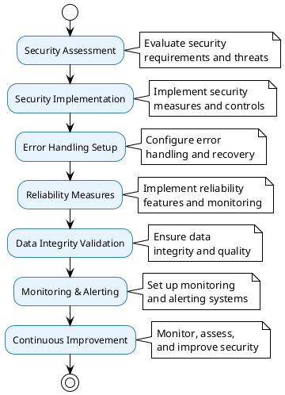

# Security & Reliability Architecture

## 🛡️ Security & Reliability Overview

The Security & Reliability architecture ensures the data processing framework operates securely and reliably in production environments, with comprehensive security measures, error handling, and operational safeguards.

## 📊 Security & Reliability Architecture Diagram

```plantuml
@startuml Security & Reliability
!theme plain
skinparam backgroundColor #FFFFFF
skinparam componentStyle rectangle

package "Security & Reliability System" {
    
    package "Security Layer" as SecurityLayer {
        component [Configuration Security] as ConfigSecurity {
            + Environment variables
            + No hardcoded secrets
            + Secure connections
            + Access control
        }
        
        component [Data Security] as DataSecurity {
            + Data encryption
            + Secure transmission
            + Access logging
            + Data masking
        }
        
        component [Network Security] as NetworkSecurity {
            + HTTPS/TLS
            + Certificate management
            + Firewall rules
            + VPN support
        }
    }
    
    package "Error Handling" as ErrorHandling {
        component [Exception Hierarchy] as ExceptionHierarchy {
            + FrameworkError
            + ConfigurationError
            + DatabaseError
            + PipelineError
        }
        
        component [Retry Logic] as RetryLogic {
            + Exponential backoff
            + Circuit breaker
            + Timeout handling
            + Error recovery
        }
        
        component [Graceful Degradation] as GracefulDegradation {
            + Fallback mechanisms
            + Partial success handling
            + Error reporting
            + System stability
        }
    }
    
    package "Reliability Features" as ReliabilityFeatures {
        component [Idempotent Operations] as IdempotentOps {
            + Safe retries
            + Duplicate prevention
            + State management
            + Consistency guarantees
        }
        
        component [Health Monitoring] as HealthMonitoring {
            + System health checks
            + Data freshness monitoring
            + Performance metrics
            + Alert generation
        }
        
        component [Process Management] as ProcessManagement {
            + Clean lifecycle
            + Resource management
            + Memory management
            + CPU optimization
        }
    }
    
    package "Data Integrity" as DataIntegrity {
        component [Schema Validation] as SchemaValidation {
            + Pydantic validation
            + Type safety
            + Data constraints
            + Business rules
        }
        
        component [Transaction Safety] as TransactionSafety {
            + ACID compliance
            + Rollback support
            + Consistency checks
            + Isolation levels
        }
        
        component [Data Quality] as DataQuality {
            + Completeness checks
            + Accuracy validation
            + Consistency monitoring
            + Quality gates
        }
    }
}

cloud "External Threats" as ExternalThreats {
    component [Network Attacks] as NetworkAttacks
    component [Data Breaches] as DataBreaches
    component [Malicious Input] as MaliciousInput
    component [System Failures] as SystemFailures
}

cloud "Internal Risks" as InternalRisks {
    component [Configuration Errors] as ConfigErrors
    component [Data Corruption] as DataCorruption
    component [Process Failures] as ProcessFailures
    component [Resource Exhaustion] as ResourceExhaustion
}

SecurityLayer --> ExternalThreats : protects against
ErrorHandling --> InternalRisks : handles
ReliabilityFeatures --> InternalRisks : prevents
DataIntegrity --> InternalRisks : validates

@enduml
```

## 🔒 Security Architecture

### Security System

```plantuml
@startuml Security System
!theme plain
skinparam backgroundColor #FFFFFF
skinparam componentStyle rectangle

package "Security System" {
    
    component [Configuration Security] as ConfigSecurity {
        + Environment variable loading
        + No hardcoded secrets
        + Secure configuration management
        + Access control
    }
    
    component [Data Security] as DataSecurity {
        + Data encryption at rest
        + Data encryption in transit
        + Secure data transmission
        + Data access logging
    }
    
    component [Network Security] as NetworkSecurity {
        + HTTPS/TLS encryption
        + Certificate management
        + Firewall configuration
        + VPN support
    }
    
    component [Access Control] as AccessControl {
        + User authentication
        + Role-based access
        + Permission management
        + Audit logging
    }
    
    component [Security Monitoring] as SecurityMonitoring {
        + Security event logging
        + Intrusion detection
        + Anomaly detection
        + Alert generation
    }
}

cloud "Security Threats" as SecurityThreats {
    component [External Attacks] as ExternalAttacks
    component [Data Breaches] as DataBreaches
    component [Insider Threats] as InsiderThreats
    component [System Vulnerabilities] as SystemVulnerabilities
}

cloud "Security Measures" as SecurityMeasures {
    component [Encryption] as Encryption
    component [Authentication] as Authentication
    component [Authorization] as Authorization
    component [Monitoring] as Monitoring
}

ConfigSecurity --> SecurityThreats : protects against
DataSecurity --> SecurityThreats : secures data
NetworkSecurity --> SecurityThreats : secures network
AccessControl --> SecurityThreats : controls access
SecurityMonitoring --> SecurityThreats : monitors for

@enduml
```

### Security Features

- **Configuration Security**: No hardcoded secrets, environment-based configuration
- **Data Security**: Encryption at rest and in transit
- **Network Security**: HTTPS/TLS encryption, certificate management
- **Access Control**: Role-based access control and audit logging
- **Security Monitoring**: Comprehensive security event monitoring

## 🚨 Error Handling Architecture

### Error Handling System

```plantuml
@startuml Error Handling
!theme plain
skinparam backgroundColor #FFFFFF
skinparam componentStyle rectangle

package "Error Handling System" {
    
    component [Exception Hierarchy] as ExceptionHierarchy {
        + FrameworkError (base)
        + ConfigurationError
        + DatabaseError
        + PipelineError
        + ValidationError
        + RetryError
    }
    
    component [Retry Logic] as RetryLogic {
        + Exponential backoff
        + Circuit breaker pattern
        + Timeout handling
        + Error recovery
    }
    
    component [Graceful Degradation] as GracefulDegradation {
        + Fallback mechanisms
        + Partial success handling
        + Error reporting
        + System stability
    }
    
    component [Error Logging] as ErrorLogging {
        + Structured error logging
        + Error context capture
        + Error categorization
        + Debug information
    }
    
    component [Error Recovery] as ErrorRecovery {
        + Automatic recovery
        + Manual intervention
        + System restart
        + Data recovery
    }
}

cloud "Error Sources" as ErrorSources {
    component [Configuration Errors] as ConfigErrors
    component [Network Errors] as NetworkErrors
    component [Database Errors] as DatabaseErrors
    component [Processing Errors] as ProcessingErrors
}

cloud "Error Responses" as ErrorResponses {
    component [Error Messages] as ErrorMessages
    component [Error Logs] as ErrorLogs
    component [Error Alerts] as ErrorAlerts
    component [Error Recovery] as ErrorRecovery
}

ExceptionHierarchy --> ErrorSources : handles
RetryLogic --> ErrorSources : retries
GracefulDegradation --> ErrorSources : degrades gracefully
ErrorLogging --> ErrorSources : logs
ErrorRecovery --> ErrorSources : recovers from

@enduml
```

### Error Handling Features

- **Comprehensive Exception Hierarchy**: Organized exception types for different error scenarios
- **Retry Logic**: Exponential backoff and circuit breaker patterns
- **Graceful Degradation**: Fallback mechanisms and partial success handling
- **Error Logging**: Structured error logging with context information
- **Error Recovery**: Automatic and manual error recovery mechanisms

## 🔄 Reliability Architecture

### Reliability System

```plantuml
@startuml Reliability System
!theme plain
skinparam backgroundColor #FFFFFF
skinparam componentStyle rectangle

package "Reliability System" {
    
    component [Idempotent Operations] as IdempotentOps {
        + Safe retries
        + Duplicate prevention
        + State management
        + Consistency guarantees
    }
    
    component [Health Monitoring] as HealthMonitoring {
        + System health checks
        + Data freshness monitoring
        + Performance metrics
        + Alert generation
    }
    
    component [Process Management] as ProcessManagement {
        + Clean lifecycle
        + Resource management
        + Memory management
        + CPU optimization
    }
    
    component [Data Integrity] as DataIntegrity {
        + Schema validation
        + Transaction safety
        + Consistency checks
        + Quality gates
    }
    
    component [Backup & Recovery] as BackupRecovery {
        + Automated backups
        + Point-in-time recovery
        + Disaster recovery
        + Data replication
    }
}

cloud "Reliability Threats" as ReliabilityThreats {
    component [System Failures] as SystemFailures
    component [Data Corruption] as DataCorruption
    component [Process Crashes] as ProcessCrashes
    component [Resource Exhaustion] as ResourceExhaustion
}

cloud "Reliability Measures" as ReliabilityMeasures {
    component [Redundancy] as Redundancy
    component [Monitoring] as Monitoring
    component [Recovery] as Recovery
    component [Prevention] as Prevention
}

IdempotentOps --> ReliabilityThreats : prevents
HealthMonitoring --> ReliabilityThreats : monitors
ProcessManagement --> ReliabilityThreats : manages
DataIntegrity --> ReliabilityThreats : validates
BackupRecovery --> ReliabilityThreats : recovers from

@enduml
```

### Reliability Features

- **Idempotent Operations**: Safe retries and duplicate prevention
- **Health Monitoring**: Comprehensive system and data health monitoring
- **Process Management**: Clean process lifecycle and resource management
- **Data Integrity**: Schema validation and transaction safety
- **Backup & Recovery**: Automated backup and disaster recovery

## 🔐 Data Integrity Architecture

### Data Integrity System

```plantuml
@startuml Data Integrity
!theme plain
skinparam backgroundColor #FFFFFF
skinparam componentStyle rectangle

package "Data Integrity System" {
    
    component [Schema Validation] as SchemaValidation {
        + Pydantic validation
        + Type safety
        + Data constraints
        + Business rules
    }
    
    component [Transaction Safety] as TransactionSafety {
        + ACID compliance
        + Rollback support
        + Consistency checks
        + Isolation levels
    }
    
    component [Data Quality] as DataQuality {
        + Completeness checks
        + Accuracy validation
        + Consistency monitoring
        + Quality gates
    }
    
    component [Data Lineage] as DataLineage {
        + Source tracking
        + Transformation tracking
        + Quality tracking
        + Compliance tracking
    }
    
    component [Data Governance] as DataGovernance {
        + Data policies
        + Compliance rules
        + Audit trails
        + Data classification
    }
}

cloud "Data Sources" as DataSources {
    component [External APIs] as ExternalAPIs
    component [Databases] as Databases
    component [Files] as Files
    component [Streams] as Streams
}

cloud "Data Destinations" as DataDestinations {
    component [ClickHouse Tables] as ClickHouseTables
    component [File Outputs] as FileOutputs
    component [API Outputs] as APIOutputs
    component [Streams] as Streams
}

SchemaValidation --> DataSources : validates
TransactionSafety --> DataDestinations : ensures
DataQuality --> DataSources : monitors
DataLineage --> DataSources : tracks
DataGovernance --> DataSources : governs

@enduml
```

### Data Integrity Features

- **Schema Validation**: Pydantic validation with type safety
- **Transaction Safety**: ACID compliance and rollback support
- **Data Quality**: Comprehensive data quality monitoring
- **Data Lineage**: Complete data lineage tracking
- **Data Governance**: Data policies and compliance management

## 🔄 Security & Reliability Workflow

### Complete Security & Reliability Flow



## 📊 Security & Reliability Benefits

### **Security Benefits**
- **Data Protection**: Comprehensive data encryption and access control
- **Threat Prevention**: Proactive security measures and monitoring
- **Compliance**: Built-in compliance and audit capabilities
- **Risk Mitigation**: Comprehensive risk assessment and mitigation

### **Reliability Benefits**
- **High Availability**: Idempotent operations and health monitoring
- **Data Integrity**: ACID compliance and data quality assurance
- **Error Recovery**: Comprehensive error handling and recovery
- **Operational Excellence**: Process management and resource optimization

### **Operational Benefits**
- **Monitoring**: Real-time monitoring and alerting
- **Maintenance**: Automated maintenance and recovery
- **Scalability**: Designed for enterprise-scale operations
- **Compliance**: Built-in compliance and governance features

The Security & Reliability architecture provides a complete foundation for secure, reliable, and compliant data processing operations in production environments.
