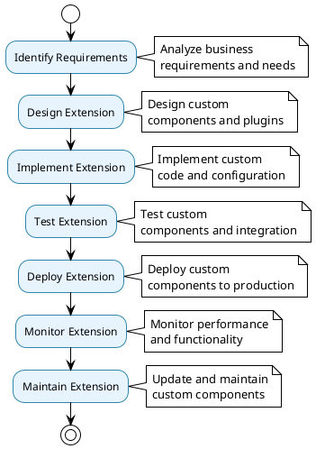

# Extension & Customization Architecture

## 🔧 Extension & Customization Overview

The Extension & Customization architecture provides comprehensive capabilities for extending and customizing the data processing framework to meet specific business requirements, with plugin architecture, custom components, and flexible configuration options.

## 📊 Extension & Customization Architecture Diagram

```plantuml
@startuml Extension & Customization
!theme plain
skinparam backgroundColor #FFFFFF
skinparam componentStyle rectangle

package "Extension & Customization System" {
    
    package "Plugin Architecture" as PluginArchitecture {
        component [Extractor Plugins] as ExtractorPlugins {
            + Custom extractors
            + Plugin interface
            + Configuration
            + Error handling
        }
        
        component [Transformer Plugins] as TransformerPlugins {
            + Custom transformers
            + Plugin interface
            + Configuration
            + Error handling
        }
        
        component [Loader Plugins] as LoaderPlugins {
            + Custom loaders
            + Plugin interface
            + Configuration
            + Error handling
        }
        
        component [Plugin Manager] as PluginManager {
            + Plugin discovery
            + Plugin loading
            + Plugin lifecycle
            + Plugin validation
        }
    }
    
    package "Customization Points" as CustomizationPoints {
        component [Pipeline Customization] as PipelineCustomization {
            + Custom pipeline patterns
            + Custom scheduling
            + Custom error handling
            + Custom logging
        }
        
        component [Configuration Customization] as ConfigCustomization {
            + Custom configuration
            + Environment variables
            + Custom validators
            + Custom defaults
        }
        
        component [UI Customization] as UICustomization {
            + Custom dashboards
            + Custom reports
            + Custom monitoring
            + Custom alerts
        }
    }
    
    package "Extension Framework" as ExtensionFramework {
        component [Extension API] as ExtensionAPI {
            + Extension interface
            + Extension lifecycle
            + Extension configuration
            + Extension validation
        }
        
        component [Extension Registry] as ExtensionRegistry {
            + Extension discovery
            + Extension loading
            + Extension management
            + Extension versioning
        }
        
        component [Extension Manager] as ExtensionManager {
            + Extension orchestration
            + Extension monitoring
            + Extension error handling
            + Extension performance
        }
    }
    
    package "Custom Components" as CustomComponents {
        component [Custom Extractors] as CustomExtractors {
            + Data source connectors
            + Custom protocols
            + Custom authentication
            + Custom data formats
        }
        
        component [Custom Transformers] as CustomTransformers {
            + Custom processing logic
            + Custom algorithms
            + Custom validation
            + Custom data formats
        }
        
        component [Custom Loaders] as CustomLoaders {
            + Custom destinations
            + Custom protocols
            + Custom authentication
            + Custom data formats
        }
    }
}

cloud "Business Requirements" as BusinessRequirements {
    component [Custom Data Sources] as CustomDataSources
    component [Custom Processing] as CustomProcessing
    component [Custom Destinations] as CustomDestinations
    component [Custom Workflows] as CustomWorkflows
}

cloud "Extension Ecosystem" as ExtensionEcosystem {
    component [Third-party Plugins] as ThirdPartyPlugins
    component [Community Extensions] as CommunityExtensions
    component [Custom Extensions] as CustomExtensions
    component [Extension Marketplace] as ExtensionMarketplace
}

PluginArchitecture --> BusinessRequirements : addresses
CustomizationPoints --> BusinessRequirements : customizes
ExtensionFramework --> BusinessRequirements : supports
CustomComponents --> BusinessRequirements : implements

@enduml
```

## 🔌 Plugin Architecture

### Plugin System

```plantuml
@startuml Plugin Architecture
!theme plain
skinparam backgroundColor #FFFFFF
skinparam componentStyle rectangle

package "Plugin Architecture" {
    
    component [Plugin Interface] as PluginInterface {
        + Base plugin class
        + Plugin lifecycle methods
        + Configuration interface
        + Error handling interface
    }
    
    component [Extractor Plugin] as ExtractorPlugin {
        + extract() method
        + configure() method
        + validate() method
        + cleanup() method
    }
    
    component [Transformer Plugin] as TransformerPlugin {
        + transform() method
        + configure() method
        + validate() method
        + cleanup() method
    }
    
    component [Loader Plugin] as LoaderPlugin {
        + load() method
        + configure() method
        + validate() method
        + cleanup() method
    }
    
    component [Plugin Manager] as PluginManager {
        + discover_plugins()
        + load_plugin()
        + unload_plugin()
        + validate_plugin()
    }
    
    component [Plugin Registry] as PluginRegistry {
        + register_plugin()
        + get_plugin()
        + list_plugins()
        + remove_plugin()
    }
}

cloud "Plugin Implementations" as PluginImplementations {
    component [Custom Extractors] as CustomExtractors
    component [Custom Transformers] as CustomTransformers
    component [Custom Loaders] as CustomLoaders
    component [Third-party Plugins] as ThirdPartyPlugins
}

cloud "Plugin Configuration" as PluginConfiguration {
    component [Plugin Configs] as PluginConfigs
    component [Plugin Metadata] as PluginMetadata
    component [Plugin Dependencies] as PluginDependencies
}

PluginInterface --> PluginImplementations : defines
PluginManager --> PluginImplementations : manages
PluginRegistry --> PluginImplementations : registers
PluginConfiguration --> PluginImplementations : configures

@enduml
```

### Plugin Features

- **Plugin Interface**: Standardized interface for all plugins
- **Plugin Lifecycle**: Complete plugin lifecycle management
- **Plugin Discovery**: Automatic plugin discovery and loading
- **Plugin Validation**: Comprehensive plugin validation
- **Plugin Registry**: Centralized plugin management

## 🎨 Customization Points

### Customization System

```plantuml
@startuml Customization Points
!theme plain
skinparam backgroundColor #FFFFFF
skinparam componentStyle rectangle

package "Customization Points" {
    
    component [Pipeline Customization] as PipelineCustomization {
        + Custom pipeline patterns
        + Custom scheduling logic
        + Custom error handling
        + Custom logging configuration
    }
    
    component [Configuration Customization] as ConfigCustomization {
        + Custom configuration models
        + Custom environment variables
        + Custom validation rules
        + Custom default values
    }
    
    component [UI Customization] as UICustomization {
        + Custom dashboards
        + Custom reports
        + Custom monitoring views
        + Custom alert configurations
    }
    
    component [Data Customization] as DataCustomization {
        + Custom data formats
        + Custom data validation
        + Custom data transformation
        + Custom data storage
    }
    
    component [Workflow Customization] as WorkflowCustomization {
        + Custom workflow patterns
        + Custom orchestration logic
        + Custom decision points
        + Custom branching logic
    }
}

cloud "Business Logic" as BusinessLogic {
    component [Domain-specific Rules] as DomainRules
    component [Custom Algorithms] as CustomAlgorithms
    component [Business Processes] as BusinessProcesses
    component [Compliance Requirements] as ComplianceRequirements
}

cloud "Customization Implementation" as CustomizationImpl {
    component [Custom Classes] as CustomClasses
    component [Custom Functions] as CustomFunctions
    component [Custom Configuration] as CustomConfiguration
    component [Custom Templates] as CustomTemplates
}

PipelineCustomization --> BusinessLogic : implements
ConfigCustomization --> BusinessLogic : configures
UICustomization --> BusinessLogic : visualizes
DataCustomization --> BusinessLogic : processes
WorkflowCustomization --> BusinessLogic : orchestrates

@enduml
```

### Customization Features

- **Pipeline Customization**: Custom pipeline patterns and logic
- **Configuration Customization**: Custom configuration and validation
- **UI Customization**: Custom dashboards and monitoring
- **Data Customization**: Custom data formats and processing
- **Workflow Customization**: Custom workflow patterns and orchestration

## 🏗️ Extension Framework

### Extension System

```plantuml
@startuml Extension Framework
!theme plain
skinparam backgroundColor #FFFFFF
skinparam componentStyle rectangle

package "Extension Framework" {
    
    component [Extension API] as ExtensionAPI {
        + Extension interface
        + Extension lifecycle
        + Extension configuration
        + Extension validation
    }
    
    component [Extension Registry] as ExtensionRegistry {
        + Extension discovery
        + Extension loading
        + Extension management
        + Extension versioning
    }
    
    component [Extension Manager] as ExtensionManager {
        + Extension orchestration
        + Extension monitoring
        + Extension error handling
        + Extension performance
    }
    
    component [Extension Validator] as ExtensionValidator {
        + Extension validation
        + Dependency checking
        + Compatibility checking
        + Security validation
    }
    
    component [Extension Loader] as ExtensionLoader {
        + Extension loading
        + Dependency resolution
        + Version management
        + Error handling
    }
}

cloud "Extension Sources" as ExtensionSources {
    component [Local Extensions] as LocalExtensions
    component [Remote Extensions] as RemoteExtensions
    component [Package Extensions] as PackageExtensions
    component [Git Extensions] as GitExtensions
}

cloud "Extension Management" as ExtensionManagement {
    component [Extension Installation] as ExtensionInstallation
    component [Extension Updates] as ExtensionUpdates
    component [Extension Removal] as ExtensionRemoval
    component [Extension Dependencies] as ExtensionDependencies
}

ExtensionAPI --> ExtensionSources : defines interface
ExtensionRegistry --> ExtensionSources : discovers
ExtensionManager --> ExtensionSources : manages
ExtensionValidator --> ExtensionSources : validates
ExtensionLoader --> ExtensionSources : loads

@enduml
```

### Extension Features

- **Extension API**: Standardized extension interface
- **Extension Registry**: Centralized extension management
- **Extension Manager**: Complete extension lifecycle management
- **Extension Validation**: Comprehensive extension validation
- **Extension Loading**: Dynamic extension loading and management

## 🔧 Custom Components

### Custom Component System

```plantuml
@startuml Custom Components
!theme plain
skinparam backgroundColor #FFFFFF
skinparam componentStyle rectangle

package "Custom Component System" {
    
    component [Custom Extractors] as CustomExtractors {
        + Data source connectors
        + Custom protocols
        + Custom authentication
        + Custom data formats
    }
    
    component [Custom Transformers] as CustomTransformers {
        + Custom processing logic
        + Custom algorithms
        + Custom validation
        + Custom data formats
    }
    
    component [Custom Loaders] as CustomLoaders {
        + Custom destinations
        + Custom protocols
        + Custom authentication
        + Custom data formats
    }
    
    component [Custom Validators] as CustomValidators {
        + Custom validation rules
        + Custom business logic
        + Custom error handling
        + Custom reporting
    }
    
    component [Custom Monitors] as CustomMonitors {
        + Custom monitoring logic
        + Custom metrics
        + Custom alerts
        + Custom dashboards
    }
}

cloud "Business Requirements" as BusinessRequirements {
    component [Domain-specific Logic] as DomainLogic
    component [Custom Protocols] as CustomProtocols
    component [Custom Data Formats] as CustomDataFormats
    component [Custom Business Rules] as CustomBusinessRules
}

cloud "Component Implementation" as ComponentImpl {
    component [Custom Classes] as CustomClasses
    component [Custom Functions] as CustomFunctions
    component [Custom Configuration] as CustomConfiguration
    component [Custom Templates] as CustomTemplates
}

CustomExtractors --> BusinessRequirements : implements
CustomTransformers --> BusinessRequirements : processes
CustomLoaders --> BusinessRequirements : stores
CustomValidators --> BusinessRequirements : validates
CustomMonitors --> BusinessRequirements : monitors

@enduml
```

### Custom Component Features

- **Custom Extractors**: Domain-specific data source connectors
- **Custom Transformers**: Business-specific data processing logic
- **Custom Loaders**: Custom destination connectors
- **Custom Validators**: Business-specific validation rules
- **Custom Monitors**: Domain-specific monitoring and alerting

## 🔄 Extension & Customization Workflow

### Complete Extension & Customization Flow



## 📊 Extension & Customization Benefits

### **Flexibility**
- **Plugin Architecture**: Easy to add new functionality
- **Customization Points**: Multiple customization options
- **Extension Framework**: Comprehensive extension support
- **Custom Components**: Complete custom component support

### **Scalability**
- **Modular Design**: Easy to scale and maintain
- **Plugin Ecosystem**: Community and third-party extensions
- **Customization**: Business-specific customizations
- **Integration**: Easy integration with existing systems

### **Maintainability**
- **Clear Interfaces**: Well-defined extension interfaces
- **Documentation**: Comprehensive extension documentation
- **Testing**: Built-in extension testing capabilities
- **Versioning**: Extension version management

The Extension & Customization architecture provides a complete foundation for extending and customizing the data processing framework to meet specific business requirements while maintaining system integrity and performance.
